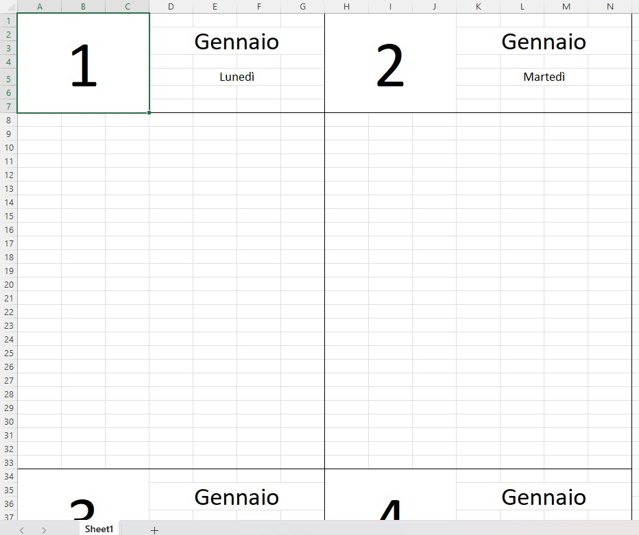
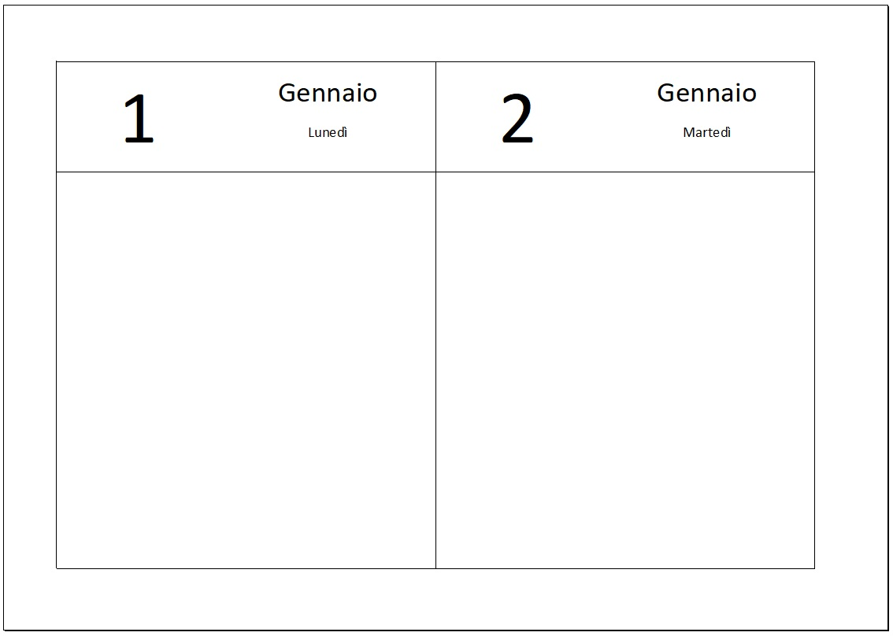

# CUSTOM CALENDAR GENERATOR

This is a simple Python script that generates a custom-formatted calendar in Excel. It creates a calendar from January 1, _<INPUT_YEAR>_, to March 31, _<INPUT_YEAR + 1>_.

## How to Use

1. _(Optional)_ Create a new Python virtual environment: `python -m venv <venv-name>`
2. _(Optional)_ Activate your virtual environment:
    - Unix-like: `source venv/bin/activate`
    - Windows: `venv\Scripts\activate`

3. Install the required dependencies: `pip install -r requirements.txt`
4. Run the script: `python custom_calendar.py <year_from>`.
    > Ensure you have a blank `calendar.xlsx` file before running the script

## Result preview
Excel preview

Print preview

